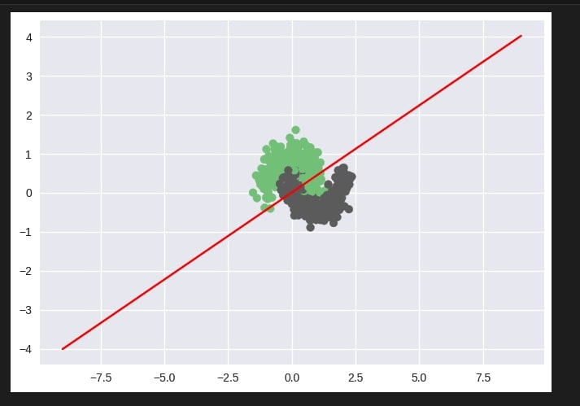

# Single-Layer Perceptron for Moons Classification 🌙

A simple implementation of a single-layer perceptron from scratch using Python. This project classifies non-linear data generated by `make_moons` using a logistic regression model and visualizes the decision boundary.

## 📋 Table of Contents
- [Introduction](#introduction)
- [Dataset](#dataset)
- [Implementation Details](#implementation-details)
- [Usage](#usage)
- [Results](#results)
- [Contributing](#contributing)

## 🌟 Introduction
This project demonstrates a basic perceptron model built from scratch to classify non-linearly separable data using logistic regression. It serves as an introduction to perceptron training, decision boundary visualization, and model evaluation.

## 📊 Dataset
The dataset is generated using the `make_moons` function from `sklearn.datasets`, producing a two-dimensional dataset of 500 samples with some added noise for non-linear separability.

## ⚙️ Implementation Details
- **Model**: Single-layer perceptron with sigmoid activation.
- **Training**: Binary cross-entropy loss minimized using gradient descent.
- **Visualization**: The decision boundary is plotted to show how the model separates classes.

### Key Functions:
- `sigmoid(z)`: Sigmoid activation function.
- `predict(X, weights)`: Computes predictions based on input features and model weights.
- `train(X, Y, learning_rate, max_epochs)`: Trains the perceptron using gradient descent.
- `get_predictions(X_test, weights)`: Generates predicted labels or probabilities.

## 🚀 Usage
1. **Clone the repository:**
    ```bash
    git clone https://github.com/Vamsi404/Single-Layer-Perceptron-Moons-Classification.git
    cd Single-Layer-Perceptron-Moons-Classification
    ```

2. **Run the code:**
    Ensure you have `numpy` and `matplotlib` installed:
    ```bash
    pip install numpy matplotlib
    ```
    Then run the code:
    ```bash
    python perceptron.py
    ```

## 📈 Results
After training, the model achieves a **training accuracy** of around 85-90% on the noisy moons dataset. The plot below shows the decision boundary separating the two classes.



## 🤝 Contributing
Contributions are welcome! Feel free to open issues, submit pull requests, or suggest improvements.
